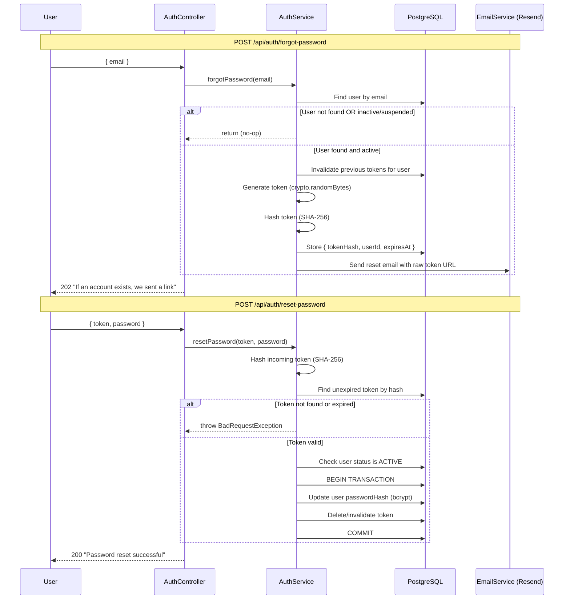

# feat: Add forgot password flow with email sending

## Overview

Add a forgot password flow to the identity module. Users submit their email to request a reset link, receive an email via Resend, and set a new password through a token-validated endpoint. Includes a new email infrastructure module, a password reset token entity, rate limiting, and security hardening per OWASP recommendations.

## Problem Frame

Users of Plot-Twist have no way to recover access to their account if they forget their password. The identity module currently only supports registration and login. Adding a forgot password flow is necessary before the app can be used by real people. (see origin: `docs/brainstorms/2026-03-28-forgot-password-requirements.md`)

## Requirements Trace

**Password Reset Flow**
- R1. User requests a password reset by submitting their email address
- R2. System sends an email containing a unique, one-time reset link
- R3. Reset link expires after 1 hour
- R4. Clicking the link allows the user to set a new password
- R5. After successful reset, the token is invalidated (single use)
- R6. Previous valid tokens for the same user are invalidated when a new reset is requested

**Security**
- R7. The forgot password endpoint always returns a generic success message regardless of whether the email exists (prevents user enumeration)
- R8. Reset tokens are stored hashed (not plaintext) in the database
- R9. Rate limiting on both forgot-password and reset-password endpoints to prevent abuse

**Email Infrastructure**
- R10. Use Resend as the email provider (free tier: 3K/month, 100/day)
- R11. Email sending is abstracted behind an interface so the provider can be swapped later

**Additional (from flow analysis)**
- R12. SUSPENDED or INACTIVE users are treated as no-op (same as unknown email — no token generated)
- R13. Password validation on reset matches registration rules (min 8, max 128)
- R14. Password update and token invalidation are wrapped in a single DB transaction
- R15. After successful reset, return 200 with success message (user redirected to login, no JWT issued)

## Scope Boundaries

- No email verification on registration (separate feature)
- No "change password" for logged-in users (separate feature)
- No email template styling beyond functional plaintext/basic HTML
- No custom domain for sending emails (use Resend default sender for now)
- No frontend implementation (Next.js reset page is out of scope)
- No retry queue or dead-letter mechanism for failed email delivery

## Context & Research

### Relevant Code and Patterns

- **Identity module structure**: `apps/api/src/module/identity/` — layered as `core/` (services), `http/` (controller + DTOs), `persistence/` (entity + enum + interface), `migrations/`
- **Entity pattern**: `@Entity({ schema: 'identity', name: '...' })` with both properties mandatory per `STATE-ISOLATION.md`
- **Auth service**: `apps/api/src/module/identity/core/auth.service.ts` — `@Injectable()`, `Logger`, repository injection, NestJS exceptions
- **Auth controller**: `apps/api/src/module/identity/http/controller/auth.controller.ts` — thin delegation, `@HttpCode` on non-201 POSTs
- **Config segments**: `apps/api/src/infra/config/segment/` — `registerAs` + constant key + `I`-prefixed interface + `Object.freeze()`
- **Env schema**: `apps/api/src/infra/config/env.schema.ts` — Zod validation, sensible dev defaults, strict secrets
- **Config module**: `apps/api/src/infra/config/config.module.ts` — `load` array for all config segments
- **Data source**: `apps/api/src/data-source.ts` — entities and migration paths registered here for CLI
- **App module**: `apps/api/src/module/app/app.module.ts` — `TypeOrmModule.forRootAsync`, `autoLoadEntities: true`
- **DTO pattern**: `class-validator` decorators, `readonly` properties, definite assignment, one per file, barrel export
- **Test patterns**: unit (`.spec.ts`), integration (`.int-spec.ts` with real DB), e2e (`.e2e-spec.ts` with supertest)
- **Test email suffixes**: `@spec.test`, `@int.test`, `@e2e.test` for isolation

### External References

- [OWASP Forgot Password Cheat Sheet](https://cheatsheetseries.owasp.org/cheatsheets/Forgot_Password_Cheat_Sheet.html) — token generation, storage, generic responses
- [Resend Node.js SDK](https://www.npmjs.com/package/resend) v6.9.4 — `resend.emails.send()` API
- [@nestjs/throttler](https://www.npmjs.com/package/@nestjs/throttler) v6.5.0 — rate limiting for NestJS 11

## Key Technical Decisions

- **Token generation: `crypto.randomBytes(32)`** — OWASP recommends CSPRNG with 128+ bits of entropy. `crypto.randomBytes(32)` produces 256 bits. UUID v4 is discouraged because it does not guarantee CSPRNG across implementations. (see origin: brainstorm deferred question)
- **Token storage: SHA-256 hash** — Tokens are high-entropy random values, so SHA-256 is sufficient (bcrypt's slow hashing provides no benefit for non-guessable inputs). (see origin: R8)
- **Email module: Custom lightweight service wrapping Resend SDK** — `@nestjs-modules/mailer` adds Nodemailer/SMTP overhead with no value for Resend's HTTP API. A custom `IEmailService` interface with a Resend implementation keeps it swappable. (see origin: brainstorm deferred question, R11)
- **Email module location: `apps/api/src/infra/mail/`** — Email is infrastructure, not domain logic. The identity module imports it via NestJS DI. (see origin: brainstorm deferred question)
- **Rate limiting: `@nestjs/throttler` v6** — Official NestJS solution. Applied globally via `APP_GUARD` with strict per-endpoint overrides on auth endpoints. Both forgot-password (3 req/15min) and reset-password (5 req/15min) are rate-limited.
- **DB transaction for reset** — Password update + token invalidation wrapped in a TypeORM `DataSource.transaction()` to prevent partial writes.
- **User status check** — SUSPENDED/INACTIVE users are treated as no-op on forgot-password (no token generated, same 202 response). Reset-password also checks status before allowing the update.
- **Post-reset behavior** — Return 200 with success message. No JWT issued. User redirected to login by frontend.

## Open Questions

### Resolved During Planning

- **Email module structure**: Standalone under `infra/mail/`, not part of identity. Infrastructure concern, not domain.
- **Token generation strategy**: `crypto.randomBytes(32)` per OWASP. UUID v4 discouraged.
- **Email abstraction pattern**: Custom service wrapping Resend SDK. No `@nestjs-modules/mailer`.
- **Reset-password response**: 200 with success message, no JWT. User logs in manually.
- **SUSPENDED/INACTIVE behavior**: No-op, same as unknown email.
- **Password validation on reset**: Same rules as registration (min 8, max 128).
- **Rate limit on reset-password**: Yes, per-IP, 5 req/15min.
- **Token URL format**: Query parameter (`?token=<raw>`). Standard approach.
- **Transaction requirement**: Yes, password update + token invalidation in single transaction.

### Deferred to Implementation

- **Exact Resend sender address**: Depends on Resend account setup. Use `onboarding@resend.dev` for development.
- **Reset URL base**: The frontend URL embedded in the email (e.g., `http://localhost:4200/reset-password`). Will be configured via env var `PASSWORD_RESET_URL`.
- **Timing attack mitigation on forgot-password**: The generic response prevents enumeration via response body, but timing differences between "email exists" and "email doesn't exist" paths could leak info. Assess during implementation whether artificial delay is warranted for a book club app.

## High-Level Technical Design

> *This illustrates the intended approach and is directional guidance for review, not implementation specification. The implementing agent should treat it as context, not code to reproduce.*

## Implementation Units

- [ ] **Unit 1: Email infrastructure module**

**Goal:** Create a reusable email module with Resend integration behind an abstract interface.

**Requirements:** R10, R11

**Dependencies:** None

**Files:**
- Create: `apps/api/src/infra/mail/mail.module.ts`
- Create: `apps/api/src/infra/mail/interface/email-service.interface.ts`
- Create: `apps/api/src/infra/mail/resend-email.service.ts`
- Create: `apps/api/src/infra/mail/index.ts`
- Create: `apps/api/src/infra/mail/__tests__/resend-email.service.spec.ts`
- Create: `apps/api/src/infra/config/segment/mail.config.ts`
- Modify: `apps/api/src/infra/config/segment/index.ts`
- Modify: `apps/api/src/infra/config/index.ts`
- Modify: `apps/api/src/infra/config/config.module.ts`
- Modify: `apps/api/src/infra/config/env.schema.ts`
- Modify: `apps/api/package.json` (add `resend` dependency)

**Approach:**
- Define `IEmailService` interface with a `send(options: ISendEmailOptions): Promise<void>` method
- `ISendEmailOptions` contains `to`, `subject`, `html`, optional `text`
- `ResendEmailService` implements `IEmailService`, wraps the Resend SDK
- Provide `IEmailService` via a DI token (e.g., `EMAIL_SERVICE`) so consumers depend on the interface
- Config segment: `mail.config.ts` with `registerAs('mail')`, exposing `apiKey` and `fromAddress`
- Env schema: add `RESEND_API_KEY` (required, no default) and `RESEND_FROM_ADDRESS` (default for dev: `'Plot-Twist <onboarding@resend.dev>'`)
- `MailModule` exports the `EMAIL_SERVICE` provider

**Patterns to follow:**
- Config segment pattern: `apps/api/src/infra/config/segment/jwt.config.ts`
- Module pattern: `apps/api/src/module/identity/identity.module.ts`
- Env schema: `apps/api/src/infra/config/env.schema.ts`

**Test scenarios:**
- Happy path: `send()` calls Resend SDK `emails.send()` with correct parameters and resolves
- Error path: `send()` throws when Resend SDK returns an error
- Error path: `send()` logs the error with appropriate context
- Edge case: `send()` handles missing optional `text` field gracefully

**Verification:**
- `MailModule` can be imported by other modules and `EMAIL_SERVICE` is injectable
- Unit tests pass with mocked Resend SDK
- Env schema rejects missing `RESEND_API_KEY` at startup

---

- [ ] **Unit 2: Password reset token entity and migration**

**Goal:** Create the database entity and migration for storing hashed password reset tokens.

**Requirements:** R3, R5, R6, R8

**Dependencies:** None (can run in parallel with Unit 1)

**Files:**
- Create: `apps/api/src/module/identity/persistence/entity/password-reset-token.entity.ts`
- Create: `apps/api/src/module/identity/persistence/interface/password-reset-token.interface.ts`
- Create: `apps/api/src/module/identity/migrations/{timestamp}-create-password-reset-token-table.ts`
- Modify: `apps/api/src/module/identity/identity.module.ts` (register entity in `forFeature`)
- Modify: `apps/api/src/data-source.ts` (register entity and verify migration path)

**Approach:**
- Entity: `@Entity({ schema: 'identity', name: 'password_reset_token' })` with columns: `id` (uuid PK), `tokenHash` (varchar, indexed), `userId` (uuid FK to identity.user), `expiresAt` (timestamp), `createdAt` (timestamp)
- No `@ManyToOne` relation decorator — use plain `uuid` column per state isolation rules (no cross-entity JOINs within the same schema is not required, but keeping it simple with a plain column + manual lookup is consistent)
- Interface: `IPasswordResetToken` with `readonly` properties
- Migration: create table with explicit constraints (`PK_identity_password_reset_token_id`, `IDX_identity_password_reset_token_token_hash`, `FK_identity_password_reset_token_user_id`)

**Patterns to follow:**
- Entity: `apps/api/src/module/identity/persistence/entity/user.entity.ts`
- Interface: `apps/api/src/module/identity/persistence/interface/user.interface.ts`
- Migration: `apps/api/src/module/identity/migrations/1708000000000-create-identity-schema-and-user-table.ts`

**Test scenarios:**
- Happy path: Entity can be instantiated with valid properties
- Integration: Entity can be persisted and retrieved from the database (covered in Unit 4 integration tests)

**Verification:**
- Migration runs successfully against PostgreSQL (creates table in `identity` schema)
- Entity is registered in TypeORM and auto-loaded

---

- [ ] **Unit 3: Forgot password and reset password DTOs**

**Goal:** Create request DTOs with validation for both endpoints.

**Requirements:** R1, R4, R13

**Dependencies:** None (can run in parallel with Units 1 and 2)

**Files:**
- Create: `apps/api/src/module/identity/http/dto/forgot-password.dto.ts`
- Create: `apps/api/src/module/identity/http/dto/reset-password.dto.ts`
- Modify: `apps/api/src/module/identity/http/dto/index.ts` (barrel export)

**Approach:**
- `ForgotPasswordDto`: `readonly email: string` with `@IsEmail()`
- `ResetPasswordDto`: `readonly token: string` with `@IsString()` + `@IsNotEmpty()`, `readonly password: string` with `@IsString()` + `@MinLength(8)` + `@MaxLength(128)`
- Password validation matches `RegisterDto` constraints exactly

**Patterns to follow:**
- DTO pattern: `apps/api/src/module/identity/http/dto/register.dto.ts`

**Test scenarios:**
- Happy path: valid DTO passes validation
- Error path: missing email is rejected
- Error path: invalid email format is rejected
- Error path: empty token is rejected
- Error path: password shorter than 8 chars is rejected
- Error path: password longer than 128 chars is rejected
- Edge case: password exactly 8 chars passes validation

**Verification:**
- DTOs are exported from barrel and importable
- Validation constraints match RegisterDto password rules

---

- [ ] **Unit 4: Auth service — forgot password and reset password logic**

**Goal:** Implement the core business logic for password reset in `AuthService`.

**Requirements:** R1, R2, R3, R5, R6, R7, R8, R12, R14, R15

**Dependencies:** Unit 1 (MailModule), Unit 2 (PasswordResetTokenEntity), Unit 3 (DTOs)

**Files:**
- Modify: `apps/api/src/module/identity/core/auth.service.ts`
- Modify: `apps/api/src/module/identity/identity.module.ts` (inject MailModule, DataSource)
- Create: `apps/api/src/module/identity/core/__tests__/auth.service.spec.ts` (extend existing)
- Create: `apps/api/src/module/identity/core/__tests__/auth.service.int-spec.ts` (extend existing)

**Approach:**
- `forgotPassword(email: string): Promise<void>`
  - Look up user by email
  - If not found OR status is not ACTIVE: return silently (R7, R12)
  - Invalidate all existing tokens for user (DELETE WHERE userId) (R6)
  - Generate raw token via `crypto.randomBytes(32).toString('hex')`
  - Hash with `crypto.createHash('sha256').update(rawToken).digest('hex')` (R8)
  - Create and save `PasswordResetTokenEntity` with hash, userId, expiresAt (now + 1 hour) (R3)
  - Send email via `IEmailService` with reset URL containing raw token (R2)
  - If email send fails: log error, do not throw (user still gets 202)
- `resetPassword(token: string, newPassword: string): Promise<void>`
  - Hash incoming token with SHA-256
  - Look up unexpired token by hash (WHERE tokenHash = hash AND expiresAt > now)
  - If not found: throw `BadRequestException('Invalid or expired reset token')`
  - Look up user by token's userId
  - If user status is not ACTIVE: throw `BadRequestException('Invalid or expired reset token')` (same message to prevent enumeration)
  - Wrap in `DataSource.transaction()`: (R14)
    - Hash new password with bcrypt (12 rounds)
    - Update user's passwordHash
    - Delete the used token (R5)
- Both methods use the existing `Logger` pattern for structured logging
- Log differently for token-not-found vs token-expired (server-side only) for debugging

**Patterns to follow:**
- Service: `apps/api/src/module/identity/core/auth.service.ts` (existing register/login methods)
- NestJS exceptions for error responses
- `@Inject(EMAIL_SERVICE)` for email service injection

**Test scenarios:**

*Unit tests (auth.service.spec.ts):*
- Happy path: `forgotPassword` with existing active user generates token, stores hash, sends email
- Happy path: `resetPassword` with valid unexpired token updates password and deletes token
- Security: `forgotPassword` with non-existent email does not throw (returns silently)
- Security: `forgotPassword` with INACTIVE user does not generate token
- Security: `forgotPassword` with SUSPENDED user does not generate token
- Security: `forgotPassword` invalidates previous tokens before creating new one
- Security: `resetPassword` with expired token throws BadRequestException
- Security: `resetPassword` with non-existent token throws BadRequestException
- Security: `resetPassword` with valid token but INACTIVE user throws BadRequestException
- Security: token hash stored in DB differs from raw token (SHA-256 applied)
- Error path: `forgotPassword` logs and continues if email sending fails
- Edge case: `forgotPassword` called twice — first token is invalidated, second token works

*Integration tests (auth.service.int-spec.ts):*
- Happy path: full forgot-password -> reset-password flow with real DB
- Integration: token is actually deleted from DB after successful reset
- Integration: previous tokens are deleted when new reset is requested
- Integration: expired token is correctly rejected (create token with past expiresAt)
- Integration: password update and token deletion happen atomically (transaction)

**Verification:**
- All unit and integration tests pass
- Token is never stored or logged in plaintext
- Generic responses for all non-happy paths

---

- [ ] **Unit 5: Auth controller endpoints and rate limiting**

**Goal:** Add the two new endpoints with rate limiting.

**Requirements:** R1, R4, R7, R9, R15

**Dependencies:** Unit 4 (AuthService methods)

**Files:**
- Modify: `apps/api/src/module/identity/http/controller/auth.controller.ts`
- Modify: `apps/api/src/module/app/app.module.ts` (import ThrottlerModule)
- Create: `apps/api/src/module/identity/http/controller/__tests__/auth.controller.spec.ts` (extend existing)
- Create: `apps/api/src/module/identity/http/controller/__tests__/auth.controller.e2e-spec.ts` (extend existing)
- Modify: `apps/api/package.json` (add `@nestjs/throttler` dependency)

**Approach:**
- `POST /api/auth/forgot-password`
  - `@HttpCode(HttpStatus.ACCEPTED)` — always 202
  - `@Throttle({ default: { limit: 3, ttl: 900000 } })` — 3 requests per 15 minutes
  - Accepts `ForgotPasswordDto`, delegates to `authService.forgotPassword(dto.email)`
  - Returns `{ message: 'If an account with that email exists, we have sent a password reset link.' }`
- `POST /api/auth/reset-password`
  - `@HttpCode(HttpStatus.OK)` — 200
  - `@Throttle({ default: { limit: 5, ttl: 900000 } })` — 5 requests per 15 minutes
  - Accepts `ResetPasswordDto`, delegates to `authService.resetPassword(dto.token, dto.password)`
  - Returns `{ message: 'Password has been reset successfully. Please log in with your new password.' }`
- `ThrottlerModule.forRoot([{ ttl: 60000, limit: 20 }])` at app module level as default
- `ThrottlerGuard` registered as `APP_GUARD`
- Existing endpoints may need `@SkipThrottle()` or appropriate limits if the global default is too restrictive

**Patterns to follow:**
- Controller: `apps/api/src/module/identity/http/controller/auth.controller.ts` (existing register/login)
- App module: `apps/api/src/module/app/app.module.ts`

**Test scenarios:**

*Unit tests (auth.controller.spec.ts):*
- Happy path: `forgot-password` delegates to service and returns 202 with generic message
- Happy path: `reset-password` delegates to service and returns 200 with success message
- Error path: `reset-password` returns 400 when service throws BadRequestException

*E2E tests (auth.controller.e2e-spec.ts):*
- Happy path: full flow — register user, call forgot-password, extract token from DB, call reset-password, login with new password
- Security: forgot-password with unknown email returns 202 (same as known email)
- Security: forgot-password with INACTIVE user returns 202
- Validation: forgot-password with invalid email returns 400
- Validation: reset-password with empty token returns 400
- Validation: reset-password with short password returns 400
- Error path: reset-password with invalid token returns 400
- Error path: reset-password with expired token returns 400
- Edge case: reset-password with already-used token returns 400
- Rate limiting: forgot-password returns 429 after 3 requests in 15 minutes

**Verification:**
- Both endpoints respond with correct status codes
- Rate limiting is active and returns 429 when exceeded
- Existing auth endpoints (register, login) still work correctly
- Full end-to-end password reset flow works

---

- [ ] **Unit 6: Environment configuration and dependency setup**

**Goal:** Add `PASSWORD_RESET_URL` env var and install new npm dependencies.

**Requirements:** R2, R9, R10

**Dependencies:** None (can be done early, but logically belongs after design is clear)

**Files:**
- Modify: `apps/api/src/infra/config/env.schema.ts`
- Modify: `apps/api/src/infra/config/segment/mail.config.ts` (add `passwordResetUrl`)
- Modify: `apps/api/src/infra/config/segment/mail.config.ts` interface
- Modify: `docker-compose.yml` (add env vars for API service)
- Modify: `.env.example` or equivalent (if it exists)
- Create: `apps/api/src/infra/config/__tests__/mail.config.spec.ts`

**Approach:**
- `PASSWORD_RESET_URL`: string, default `'http://localhost:4200/reset-password'` for dev
- Add to mail config segment alongside `apiKey` and `fromAddress`
- The reset URL is used in `AuthService.forgotPassword()` to construct the email link: `${passwordResetUrl}?token=${rawToken}`
- Docker compose: add `RESEND_API_KEY` and `PASSWORD_RESET_URL` to API service environment

**Patterns to follow:**
- Env schema: `apps/api/src/infra/config/env.schema.ts`
- Config segment: `apps/api/src/infra/config/segment/jwt.config.ts`

**Test scenarios:**
- Happy path: valid env vars produce correct config object
- Error path: missing RESEND_API_KEY causes startup failure
- Edge case: PASSWORD_RESET_URL uses default when not provided

**Verification:**
- App starts with valid env vars
- App fails to start with missing RESEND_API_KEY
- Config object is frozen (immutable)

## System-Wide Impact

- **Interaction graph:** `AuthController` -> `AuthService` -> `PasswordResetTokenEntity` (TypeORM), `IEmailService` (Resend). `MailModule` is imported by `IdentityModule`. `ThrottlerModule` + `ThrottlerGuard` are global and affect all endpoints.
- **Error propagation:** Email sending failures are caught and logged but do not propagate to the user (202 always). Token validation failures throw `BadRequestException` which is handled by NestJS default exception filter. Rate limit violations return 429 via ThrottlerGuard.
- **State lifecycle risks:** Password update + token deletion must be transactional. If either fails independently, the system enters an inconsistent state (password changed but token still valid, or vice versa).
- **API surface parity:** No other interfaces consume these endpoints yet. Frontend integration is out of scope.
- **Integration coverage:** The e2e tests cover the full flow (register -> forgot-password -> extract token from DB -> reset-password -> login with new password), which is the critical cross-layer scenario that unit tests alone cannot prove.
- **Unchanged invariants:** Existing `POST /api/auth/register` and `POST /api/auth/login` endpoints are not modified. The global ThrottlerGuard addition may affect their behavior — verify existing tests still pass with rate limiting active, and adjust limits or add `@SkipThrottle()` if needed.

## Risks & Dependencies

| Risk | Mitigation |
|------|------------|
| Global ThrottlerGuard breaks existing endpoints | Test existing auth endpoints still pass; adjust global default or use @SkipThrottle() |
| Resend API key not available in CI | Mock email service in tests; only integration with Resend is tested manually or in a dedicated test |
| Timing attack on forgot-password (email exists vs not) | Acceptable risk for a book club app; can add artificial delay later if needed |
| Token collision (SHA-256) | Astronomically unlikely with 256-bit random input; not worth engineering against |
| Email delivery failure leaves user unaware | Log the failure; no retry queue for now; user can request again |

## Documentation / Operational Notes

- Update `.env.example` (if it exists) with `RESEND_API_KEY`, `RESEND_FROM_ADDRESS`, `PASSWORD_RESET_URL`
- ADRs already written: `docs/adr/0003-use-resend-for-transactional-email.md`, `docs/adr/0004-forgot-password-flow-behavior.md`

## Sources & References

- **Origin document:** [docs/brainstorms/2026-03-28-forgot-password-requirements.md](docs/brainstorms/2026-03-28-forgot-password-requirements.md)
- **ADRs:** [docs/adr/0003](docs/adr/0003-use-resend-for-transactional-email.md), [docs/adr/0004](docs/adr/0004-forgot-password-flow-behavior.md)
- **OWASP Forgot Password Cheat Sheet:** https://cheatsheetseries.owasp.org/cheatsheets/Forgot_Password_Cheat_Sheet.html
- **Resend Node.js SDK:** https://www.npmjs.com/package/resend (v6.9.4)
- **@nestjs/throttler:** https://www.npmjs.com/package/@nestjs/throttler (v6.5.0)
- **State isolation:** docs/STATE-ISOLATION.md
- **Domain definition:** docs/DOMAINS-DEFINITION.md (BC1: Identity)
