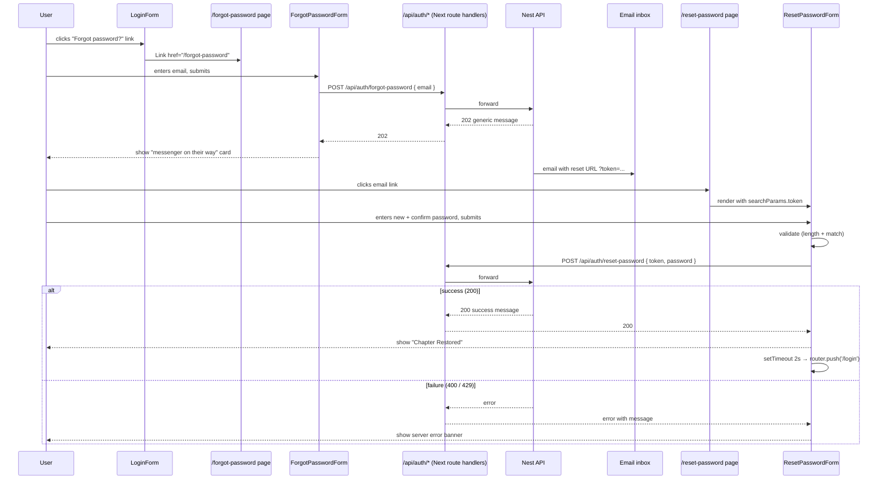

# feat: Add forgot/reset password UI screens

## Overview

Wire the Plot-Twist Next.js frontend to the existing `/api/auth/forgot-password` and `/api/auth/reset-password` endpoints by adding two new screens under the `(auth)` route group. Translate the Stitch designs ("Forgot Password" and "Reset Password") into the existing CSS-module + custom-component pattern, reusing `BrandPanel`, `AuthInput`, `PasswordInput`, `SubmitButton`, and `LoadingOverlay`. Replace the static "Forgot password?" span on the login form with a real link.

## Problem Frame

The backend forgot-password flow shipped in `2026-03-28-001-feat-forgot-password-flow-plan.md` and the email reset link points to `${PASSWORD_RESET_URL}?token=<raw>` (default `http://localhost:4200/reset-password`). That route does not yet exist in the web app, so users who click the email currently hit a 404. There is also no UI for requesting a reset in the first place — the login page shows "Forgot password?" as a non-clickable span. Until both screens exist, the feature is shipped on the backend but invisible to users. (see origin: `docs/brainstorms/2026-03-28-forgot-password-requirements.md`)

## Requirements Trace

Carried from the origin brainstorm and constrained to the UI surface:

- **R1.** User can request a password reset by submitting their email on a dedicated page (origin R1)
- **R4.** User can set a new password by following the email link, which lands on the reset page with `?token=<raw>` (origin R4)
- **R7-UI.** The forgot-password success state is generic — it must not confirm whether the email exists (origin R7, mirrored on the client)
- **R13.** Password validation on reset matches the login/register rules (`min 8`, `max 128`) — already implemented in `validatePassword`
- **R15.** After successful reset, the user is sent to `/login` (no JWT issued; the API returns 200 with a success message)

UI-specific:

- **UI1.** Both pages render the existing two-column `(auth)` layout with `BrandPanel` on the left
- **UI2.** Visual fidelity to the Stitch designs — copy, typography, colors, spacing, button labels
- **UI3.** Reset page includes a "Confirm Password" field with client-side match validation (Stitch design + user choice)
- **UI4.** Forgot success replaces the form inline with a "messenger sent" card (matches the hidden card in the Stitch HTML)
- **UI5.** Reset success shows a "Chapter Restored" inline state, then auto-redirects to `/login` after ~2 seconds
- **UI6.** Invalid/expired token is surfaced only on submit via the existing API error message

## Scope Boundaries

- No new backend endpoints or backend changes (forgot/reset endpoints already exist)
- No new test infrastructure for the web app (Jest is not currently configured for `apps/web`); verification is via the running dev server + TypeScript checks. Test scenarios are enumerated for future use
- No flash/toast system — success/error states are rendered inline
- No pre-emptive token validation on reset page load (deferred per user choice)
- No route-specific brand-panel copy in this iteration — `BrandPanel` stays static
- No password-strength meter beyond min/max length
- No rate-limit-exceeded UX beyond surfacing the API's 429 message in the existing error banner

## Context & Research

### Relevant Code and Patterns

- **Auth route group:** `apps/web/src/app/(auth)/layout.tsx` provides the two-column grid via `layout.module.css`. New routes drop in as sibling folders.
- **Existing pages:** `apps/web/src/app/(auth)/login/page.tsx`, `apps/web/src/app/(auth)/register/page.tsx` — thin shells that render a form component and set `metadata.title`.
- **Existing forms:** `apps/web/src/components/auth/login-form.tsx`, `register-form.tsx` — `'use client'`, local state, `useAuth()` hook, `validate*Form()` helpers, `LoadingOverlay`, server-error banner, footer with cross-link.
- **Reusable components:** `AuthInput`, `PasswordInput` (already supports show/hide toggle), `SubmitButton` (handles `isLoading`), `LoadingOverlay`, `BrandPanel`.
- **Design tokens:** `apps/web/src/app/global.css` exposes the same colors and fonts as the Stitch mocks (`--color-dark-green` = `#2C3631`, `--color-cream` = `#F9F5EC`, `--color-terracotta` = `#A85A48`, `--font-heading` = Young Serif, `--font-body` = Newsreader, `--font-label` = Karla). No new tokens needed.
- **API client:** `apps/web/src/lib/api-client.ts` — `AuthApiError`, `handleResponse<T>`, `loginUser`, `registerUser`. Returns parsed JSON or throws with the API's `message`.
- **Auth context:** `apps/web/src/lib/auth-context.tsx` — exposes `login/register/logout`. Forgot/reset calls do not affect the authenticated user, so they should bypass the context and call the API client directly (consistent with the backend behavior of issuing no JWT).
- **Validation helpers:** `apps/web/src/lib/validation.ts` — `validateEmail`, `validatePassword`, `validateLoginForm`, `validateRegisterForm`. Add `validateForgotPasswordForm` and `validateResetPasswordForm` here for parity.
- **Middleware:** `apps/web/src/middleware.ts` — currently only redirects between `/login`/`/register` and `/`. New `/forgot-password` and `/reset-password` routes are public; either add them to `AUTH_ROUTES` (so an authenticated user gets bounced to `/`) or leave them off the matcher entirely.
- **Login link:** `apps/web/src/components/auth/login-form.tsx:87` currently renders `<span className={styles.link}>Forgot password?</span>` — must become `<Link href="/forgot-password">`.
- **Stitch design source:** Forgot screen `projects/13478251991002849440/screens/c9ebe24c69d44ff98fd886f68a169f42`; Reset screen `projects/13478251991002849440/screens/d0199b28a02c4e41b40df4dd2169749a`. Downloaded HTML is Tailwind-based but uses the same font/color palette already exposed in `global.css`.

### Backend Contract (already shipped, do not modify)

- `POST /api/auth/forgot-password` — body `{ email: string }`, always returns 202 with `{ message: 'If an account with that email exists, we have sent a password reset link.' }`. Rate-limited 3/15min.
- `POST /api/auth/reset-password` — body `{ token: string, password: string }`. On success: 200 with `{ message: 'Password has been reset successfully. Please log in with your new password.' }`. On failure: 400 with `{ message: 'Invalid or expired reset token' }` (also covers SUSPENDED/INACTIVE users to prevent enumeration). Rate-limited 5/15min.
- Email link format: `${PASSWORD_RESET_URL}?token=<raw>` → `http://localhost:4200/reset-password?token=<raw>` in dev.

### Stitch Copy (translated to existing components)

| Element | Forgot screen | Reset screen |
|---|---|---|
| Page title (`<title>`) | "Forgot password \| Plot-Twist" | "Reset password \| Plot-Twist" |
| Heading (h2) | "Forgot Password?" | "Reset Password" |
| Subtitle | "Enter the email associated with your shelf, and we'll help you find your way back." | "Enter your new credentials to regain access to your library." |
| Field labels | "Email address" | "New password", "Confirm password" |
| Input placeholder | "curator@plot-twist.com" | (leave default password placeholder, or omit) |
| Primary button | "Send Reset Link" | "Renew My Access" |
| Secondary link | "Return to Login" → `/login` | "Back to Sign In" → `/login` |
| Success heading | "A library messenger is on their way with your reset link." | "Chapter Restored" |
| Success body | "Please check your inbox (and perhaps the dustier corners of your spam folder) to continue your journey." | "Your password has been successfully updated. Redirecting you to the library..." |

### Institutional Learnings

No `docs/solutions/` entries match. The closest precedent is the existing login/register flow itself — follow its conventions exactly (same component shape, error banner, submit-button states, footer composition).

### External References

- Stitch project: https://stitch.withgoogle.com/projects/13478251991002849440 — "Forgot Password" and "Reset Password" screens

## Key Technical Decisions

- **Bypass `useAuth()` for forgot/reset.** Forgot/reset do not authenticate the user (no JWT cookie is set). Calling them through the auth context would muddy its responsibility (which today is "the currently logged-in user"). Add direct exports `forgotPassword()` and `resetPassword()` to `api-client.ts` and call them from the forms.
- **Reuse existing components verbatim.** `AuthInput` and `PasswordInput` already cover the labels/visibility-toggle behaviors shown in the Stitch mocks. No new low-level form primitives are needed for fidelity.
- **`Suspense` boundary around `useSearchParams()`.** Next.js 16 App Router requires it for static rendering. Wrap `ResetPasswordForm` (which reads `?token`) in a `<Suspense>` at the page level.
- **Confirm-password validation is purely client-side.** The API still receives a single `password`. `validateResetPasswordForm` returns a `confirmPassword` error when the two values differ.
- **Generic forgot success regardless of API outcome.** As long as the request returns 2xx, show the success card. On non-2xx (e.g., 429 rate-limit), show the existing error banner — never reveal whether the email is registered.
- **Auto-redirect on reset success uses `setTimeout` + `router.push('/login')`.** Mirrors the Stitch "Redirecting you to the library..." copy. Clean up the timer if the component unmounts first.
- **Public-route handling in middleware.** Add `/forgot-password` and `/reset-password` to `AUTH_ROUTES` so authenticated users land on `/` instead of seeing the password-reset UI. Update the `matcher` array accordingly.
- **No new test harness.** Web app has no Jest config today. Verification is via dev server + TypeScript. Test scenarios are documented for the day Jest/Playwright is added.

## Open Questions

### Resolved During Planning

- **Confirm Password field on reset:** Add it with client-side match validation (user choice).
- **Forgot success behavior:** Replace the form inline with the success card; stay on `/forgot-password` (user choice).
- **Reset success behavior:** Inline "Chapter Restored" state, then `router.push('/login')` after ~2s (user choice).
- **Invalid/expired token UX:** Render the form, surface the API's 400 message in the existing error banner on submit (user choice).
- **Brand panel copy:** Stays static for this iteration. Stitch shows route-specific copy ("The Archive Always Remembers"; "Every story deserves a fresh start"); revisit as a follow-up.
- **Token URL format:** Already fixed by the backend (`?token=<raw>`); the frontend reads `searchParams.get('token')`.
- **Auth-context coupling:** Forgot/reset bypass the auth context and call the API directly — see Key Technical Decisions.

### Deferred to Implementation

- **Confirm-password validation copy:** "Passwords must match" vs. something themed (e.g., "These chapters don't quite line up"). Pick during implementation; minor.
- **Exact `setTimeout` duration before reset auto-redirect:** ~2000 ms feels right; tune in the browser. Make it a named constant so it's easy to find.
- **Whether to disable inputs while loading:** `SubmitButton` already disables itself; deciding whether the inputs also lock visually is a small detail to settle when the screens are wired up.
- **Web app testing harness:** Setting up Jest/RTL or Playwright is a separate initiative — out of scope here.

## High-Level Technical Design

> *This illustrates the intended approach and is directional guidance for review, not implementation specification. The implementing agent should treat it as context, not code to reproduce.*



```text
apps/web/src/
├── app/
│   ├── (auth)/
│   │   ├── login/page.tsx          (existing)
│   │   ├── register/page.tsx       (existing)
│   │   ├── forgot-password/
│   │   │   └── page.tsx            (NEW)
│   │   └── reset-password/
│   │       └── page.tsx            (NEW — wraps form in <Suspense>)
│   └── api/auth/
│       ├── forgot-password/
│       │   └── route.ts            (NEW thin proxy → Nest API)
│       └── reset-password/
│           └── route.ts            (NEW thin proxy → Nest API)
├── components/auth/
│   ├── forgot-password-form.tsx    (NEW)
│   ├── forgot-password-form.module.css  (NEW)
│   ├── reset-password-form.tsx     (NEW)
│   └── reset-password-form.module.css   (NEW)
├── lib/
│   ├── api-client.ts               (modify — add forgotPassword, resetPassword)
│   └── validation.ts               (modify — add validateForgotPasswordForm, validateResetPasswordForm)
└── middleware.ts                   (modify — add new routes)
```

> *Note: the `app/api/auth/forgot-password/route.ts` and `reset-password/route.ts` proxies mirror the existing pattern of the login/register/logout/me handlers. Confirm during implementation whether they are needed (i.e., whether the existing handlers fetch `${API_URL}/...` server-side or whether the browser hits the Nest API directly). The same approach as `/api/auth/login` should be followed here.*

## Implementation Units

- [ ] **Unit 1: API client + validation helpers**

**Goal:** Add the wire-format helpers for forgot/reset and the corresponding form-level validators.

**Requirements:** R1, R4, R13, UI3

**Dependencies:** None

**Files:**
- Modify: `apps/web/src/lib/api-client.ts`
- Modify: `apps/web/src/lib/validation.ts`
- Test (deferred — no harness): `apps/web/src/lib/__tests__/api-client.spec.ts`, `apps/web/src/lib/__tests__/validation.spec.ts`

**Approach:**
- `forgotPassword({ email }: { email: string }): Promise<{ message: string }>` — `POST /api/auth/forgot-password`, `credentials: 'same-origin'`, parse via `handleResponse`. Returns the API message so the UI can show it as fallback if needed (current API copy is fine to use directly).
- `resetPassword({ token, password }: { token: string; password: string }): Promise<{ message: string }>` — `POST /api/auth/reset-password`. Same shape.
- `validateForgotPasswordForm({ email })` — wraps `validateEmail`.
- `validateResetPasswordForm({ password, confirmPassword })` — runs `validatePassword(password)`, then if `password !== confirmPassword` adds `confirmPassword: 'Passwords must match'`. Token presence is *not* validated client-side per the resolved decision.

**Patterns to follow:**
- `loginUser`/`registerUser` shape in `apps/web/src/lib/api-client.ts:30`
- `validateLoginForm` shape in `apps/web/src/lib/validation.ts:47`

**Test scenarios:**
- *Happy path* — `forgotPassword` posts the right body and returns the parsed `message`
- *Error path* — `forgotPassword` throws `AuthApiError` with the API's `message` and status when the response is non-2xx
- *Happy path* — `resetPassword` posts `{ token, password }` and returns the parsed `message`
- *Error path* — `resetPassword` surfaces the API's 400 `Invalid or expired reset token` message via `AuthApiError`
- *Happy path* — `validateForgotPasswordForm` returns `{}` for a valid email
- *Error path* — `validateForgotPasswordForm` returns `{ email: 'Email is required' }` for empty input
- *Happy path* — `validateResetPasswordForm` returns `{}` when both passwords match and meet length rules
- *Error path* — `validateResetPasswordForm` returns `{ confirmPassword: 'Passwords must match' }` when the two values differ
- *Edge case* — `validateResetPasswordForm` reports the password-length error first when the password itself is invalid (so users aren't told their mismatched-but-too-short password "doesn't match")

**Verification:**
- `pnpm nx typecheck web` passes
- New helpers are exported and importable from the form components in later units

---

- [ ] **Unit 2: Forgot Password page + form component**

**Goal:** Build the `/forgot-password` route per the Stitch design, wire it to the API, and render the success card on 2xx.

**Requirements:** R1, R7-UI, UI1, UI2, UI4

**Dependencies:** Unit 1

**Files:**
- Create: `apps/web/src/app/(auth)/forgot-password/page.tsx`
- Create: `apps/web/src/components/auth/forgot-password-form.tsx`
- Create: `apps/web/src/components/auth/forgot-password-form.module.css`
- Create (if the existing app proxies through Next route handlers): `apps/web/src/app/api/auth/forgot-password/route.ts`

**Approach:**
- Page is a server component, sets `metadata.title = 'Forgot password | Plot-Twist'`, renders `<ForgotPasswordForm />`.
- Form is `'use client'`, uses `useState` for `email`, `errors`, `serverError`, `isLoading`, `isSubmitted`.
- On submit: validate locally → call `forgotPassword({ email })` → on success set `isSubmitted = true` and *do not* clear the email (the success card is rendered conditionally; the form unmounts visually). On non-2xx: set `serverError` from `AuthApiError.message` (covers 429 rate-limit). Never branch UI on whether the email "exists" — the success card is the same regardless.
- Success card uses an icon analogous to the Stitch `mark_as_unread` glyph. Either pull a small inline SVG into `components/icons/` or reuse `BookIcon`. The exact icon choice is implementation detail; copy is what matters.
- Footer mirrors `LoginForm`: a "Return to login" link to `/login` and the same copyright line, using the existing CSS module patterns. No "request a card" link here.
- Replicate the visual structure used in `login-form.module.css` (heading, subtitle, form gap, errorBanner, footer) — copy that file and tweak as needed for the success-card layout.

**Patterns to follow:**
- `login-form.tsx` for state shape and submit flow
- `login-form.module.css` for typography/layout
- `loading-overlay.tsx` usage during the in-flight POST

**Test scenarios:**
- *Happy path* — submitting a valid email POSTs and renders the success card
- *Happy path* — success card copy matches the Stitch design and is the *only* thing rendered after submission
- *Edge case* — submitting with an empty email shows the inline `email` validation error and does not POST
- *Edge case* — submitting with a malformed email shows the format error
- *Error path* — when the API returns 429, the error banner shows the API's rate-limit message and the success card does *not* render
- *Integration* — clicking "Return to Login" navigates to `/login`
- *Integration* — visiting `/forgot-password` while authenticated redirects to `/` (covered by middleware in Unit 5)
- *Security* — the same success card renders for both known and unknown emails (the UI must not branch on the response body)

**Verification:**
- `pnpm nx serve web` + manual: `/forgot-password` renders the design, success card replaces the form on submit, error banner appears on a forced 429, "Return to Login" works
- `pnpm nx typecheck web` passes

---

- [ ] **Unit 3: Reset Password page + form component**

**Goal:** Build the `/reset-password` route, read `?token`, dual password fields with match check, success state with auto-redirect.

**Requirements:** R4, R13, R15, UI1, UI2, UI3, UI5, UI6

**Dependencies:** Unit 1

**Files:**
- Create: `apps/web/src/app/(auth)/reset-password/page.tsx`
- Create: `apps/web/src/components/auth/reset-password-form.tsx`
- Create: `apps/web/src/components/auth/reset-password-form.module.css`
- Create (if proxying): `apps/web/src/app/api/auth/reset-password/route.ts`

**Approach:**
- Page wraps `<ResetPasswordForm />` in `<Suspense fallback={null}>` because the form uses `useSearchParams()` (Next.js 16 requirement).
- Form is `'use client'`. Reads `useSearchParams().get('token') ?? ''`. Holds state for `password`, `confirmPassword`, `errors`, `serverError`, `isLoading`, `isSuccess`.
- Two `PasswordInput`s with labels "New password" and "Confirm password", `autoComplete="new-password"` on both.
- On submit: run `validateResetPasswordForm({ password, confirmPassword })`. If valid, call `resetPassword({ token, password })`. On 200: set `isSuccess = true`, store the timeout id in a ref, and `setTimeout(() => router.push('/login'), 2000)`. Clear the timeout on unmount. On error: surface `AuthApiError.message` in the banner — this naturally covers the missing-token, expired-token, used-token, and rate-limit cases.
- Success state ("Chapter Restored" / "Your password has been successfully updated. Redirecting you to the library...") replaces the form inline, with a small progress hint matching the Stitch markup (e.g., a thin animated bar or just the static text — implementation choice, copy is fixed).
- Footer mirrors the login form pattern with a single "Back to Sign In" link → `/login`.

**Patterns to follow:**
- `register-form.tsx` for two-stateful-inputs + validation
- `password-input.tsx` for the show/hide toggle (already implemented)
- `LoadingOverlay` for the in-flight state

**Test scenarios:**
- *Happy path* — valid token + matching valid passwords → POST → success state renders
- *Happy path* — after success, after ~2s the user is on `/login` (`router.push` called once)
- *Edge case* — passwords too short → `password` error shown, no POST
- *Edge case* — passwords don't match → `confirmPassword` error shown, no POST
- *Edge case* — landing on `/reset-password` with no `?token` query param → form renders; submitting yields the API's 400 error in the banner
- *Error path* — 400 "Invalid or expired reset token" → banner shows the message, success state does *not* render
- *Error path* — 429 rate-limit → banner shows the API's message, no success state
- *Integration* — token containing URL-special characters round-trips correctly (e.g., URL-encoded values from email clients) — relies on `useSearchParams` decoding
- *Integration* — component unmounts (user navigates away) before the 2s timer fires → no React warning, no orphan navigation
- *Security* — the same generic 400 message renders for "wrong token" and "user inactive" cases (the UI does not need to distinguish — the API already collapses both)

**Verification:**
- `pnpm nx serve web` + manual: visit `/reset-password?token=anything`, submit; verify success state and auto-redirect to `/login`
- Run the full e2e flow against a local API: register → forgot-password → grab token from DB → open reset link → reset → log in with new password
- `pnpm nx typecheck web` passes

---

- [ ] **Unit 4: Wire login form's "Forgot password?" link**

**Goal:** Replace the static span on the login form with a real link to `/forgot-password`.

**Requirements:** R1 (entry point)

**Dependencies:** Unit 2 (route exists)

**Files:**
- Modify: `apps/web/src/components/auth/login-form.tsx`

**Approach:**
- At `apps/web/src/components/auth/login-form.tsx:87`, replace `<span className={styles.link}>Forgot password?</span>` with `<Link href="/forgot-password" className={styles.link}>Forgot password?</Link>`.
- `Link` is already imported. No CSS change needed.

**Patterns to follow:**
- The "Request a library card (Sign up)" Link two lines below — same styling, same import.

**Test scenarios:**
- *Happy path* — clicking "Forgot password?" navigates to `/forgot-password`
- *Edge case* — keyboard tab order still places the link before "Request a library card"

**Verification:**
- Manual: from `/login`, clicking "Forgot password?" lands on the new screen

---

- [ ] **Unit 5: Middleware + route protection**

**Goal:** Treat `/forgot-password` and `/reset-password` as auth-only-when-not-logged-in (like `/login` and `/register`).

**Requirements:** UI1 (consistent route group behavior)

**Dependencies:** Units 2 and 3 (routes exist)

**Files:**
- Modify: `apps/web/src/middleware.ts`

**Approach:**
- Add `'/forgot-password'` and `'/reset-password'` to `AUTH_ROUTES`.
- Add the same two paths to `config.matcher`.
- `PROTECTED_ROUTES` is unchanged.
- Result: an authenticated user hitting either page is redirected to `/`; an unauthenticated user passes through.

**Patterns to follow:**
- The existing `/login`/`/register` entries in `apps/web/src/middleware.ts:3`.

**Test scenarios:**
- *Happy path* — unauthenticated user can access `/forgot-password` and `/reset-password`
- *Edge case* — authenticated user (cookie `token` present) is redirected from `/forgot-password` to `/`
- *Edge case* — authenticated user is redirected from `/reset-password?token=...` to `/` (token query is dropped, which is acceptable — they're already logged in)

**Verification:**
- Manual: log in, paste `/forgot-password` into the URL bar → bounced to `/`. Log out, repeat → page renders.

---

- [ ] **Unit 6: Manual verification + cleanup pass**

**Goal:** Walk the full feature path end-to-end against a running stack and tighten visual fidelity to the Stitch designs.

**Requirements:** All UI requirements

**Dependencies:** Units 1-5

**Files:** none (verification only); minor CSS tweaks possible

**Approach:**
1. `docker compose up postgres -d`; `pnpm nx serve api`; `pnpm nx serve web`.
2. Register a test user via `/register`.
3. From `/login`, click "Forgot password?", verify navigation.
4. Submit the registered email; confirm success card renders.
5. Submit a *different* (unknown) email; confirm the same success card renders (no enumeration).
6. Read the reset token from the `identity.password_reset_token` table (raw token won't be there — pull the email from the Resend dashboard, or temporarily log it in dev).
7. Open the reset URL; verify two fields, mismatch validation, success state, auto-redirect to `/login`.
8. Re-attempt the reset URL after success → verify the 400 banner.
9. Log in with the new password.
10. Side-by-side compare against the Stitch screenshots; nudge spacing/colors only if a clear mismatch is visible.

**Test scenarios:** see Units 1-3 — this unit is the integration sweep, not new coverage.

**Verification:**
- Full flow works without manual DB intervention beyond grabbing the token
- TypeScript passes: `pnpm nx typecheck web && pnpm nx typecheck api`
- Visual comparison: headings, subtitles, button labels, footer link copy match the Stitch design

## System-Wide Impact

- **Interaction graph:** New routes plug into the existing `(auth)` layout. `LoginForm` gains an outbound link. `middleware.ts` matcher list grows. No backend changes — the API contract is already shipped and tested.
- **Error propagation:** Every error path bubbles through `AuthApiError.message`, which the existing forms render in `.errorBanner`. The 429 rate-limit case is a free win because the API already returns a usable message.
- **State lifecycle risks:**
  - Reset success uses `setTimeout` + `router.push`. If the user navigates away before the timer fires, the timer must be cleared on unmount to avoid a stale `router.push` and a React warning.
  - Forgot success replaces the form. Browser back-button after success returning the form with the email still typed is fine — the `isSubmitted` state is component-local and resets on remount.
- **API surface parity:** Forgot/reset call the same Next route-handler proxy pattern as login/register. If `/api/auth/login/route.ts` does any cookie forwarding or response shaping, mirror that exactly. (For forgot/reset there is no cookie or token to forward, so the proxy is a straight passthrough.)
- **Integration coverage:** The full register → forgot → reset → login loop in Unit 6 is the only end-to-end proof. Component tests would not catch token-encoding bugs or cookie-handling regressions.
- **Unchanged invariants:**
  - `/login`, `/register`, `/api/auth/login`, `/api/auth/register`, `/api/auth/me`, `/api/auth/logout` behavior is unchanged
  - `AuthContext` shape is unchanged — adding forgot/reset there was considered and rejected
  - `BrandPanel` copy is unchanged (route-specific copy deferred)
  - The two-column `(auth)` layout is unchanged
  - The Nest API contract is unchanged

## Risks & Dependencies

| Risk | Mitigation |
|------|------------|
| Next.js 16 throws when `useSearchParams()` runs outside a `<Suspense>` boundary at build time | Wrap `<ResetPasswordForm />` in `<Suspense>` at the page level (called out in Unit 3) |
| Auto-redirect timer fires after the user navigates away | Store the timer in a ref; clear it in a `useEffect` cleanup |
| Reset link from email contains URL-special characters that aren't decoded correctly | Use `useSearchParams().get('token')` (decodes) — do not pull from `window.location.search` raw |
| `AuthApiError.message` for 429 is rendered verbatim and may be unfriendly | Acceptable for v1; the existing API message is reasonable. Reword later if it tests poorly |
| Web-app test harness absence means regressions are caught manually | Documented as a deferred concern; manual verification matrix is enumerated in Unit 6 |
| Visual drift from the Stitch design over time | Stitch screens live in the design tool; reference the URLs in this plan for future audits |

## Documentation / Operational Notes

- No new env vars on the web side. The web app already reaches the API via the existing `/api/auth/*` proxy pattern.
- No ADR needed; this is a UI implementation of an already-decided feature (ADR `0003-use-resend-for-transactional-email.md` and `0004-forgot-password-flow-behavior.md` cover the cross-cutting decisions).
- Update the project README only if it links to a "supported routes" table; otherwise leave it.

## Sources & References

- **Origin document:** [docs/brainstorms/2026-03-28-forgot-password-requirements.md](../brainstorms/2026-03-28-forgot-password-requirements.md)
- **Backend plan (already shipped):** [docs/plans/2026-03-28-001-feat-forgot-password-flow-plan.md](2026-03-28-001-feat-forgot-password-flow-plan.md)
- **Stitch project:** https://stitch.withgoogle.com/projects/13478251991002849440
- **Stitch screens used:** "Forgot Password" (`screens/c9ebe24c69d44ff98fd886f68a169f42`), "Reset Password" (`screens/d0199b28a02c4e41b40df4dd2169749a`)
- **Existing patterns referenced:** `apps/web/src/components/auth/login-form.tsx`, `register-form.tsx`, `apps/web/src/lib/api-client.ts`, `apps/web/src/lib/validation.ts`, `apps/web/src/middleware.ts`
- **State isolation:** docs/STATE-ISOLATION.md
- **Domain definition:** docs/DOMAINS-DEFINITION.md (BC1: Identity)
